# Zithara.ai Demonstration — Frame-by-Frame Video & Audio Analysis

This document provides a deep, frame-by-frame breakdown of the 40:24 demonstration video (`CRM eclat.mov`) and accompanying meeting notes (`CRM eclat notes.docx`), analyzing the Zithara.ai omnichannel jewelry CRM platform, extracting key UI screenshots, analyzing the conversation and objections, and comparing every capability against the current **Eclat / CaratOS** codebase.

---

## 1. Executive Summary & Core Platform Overview

Zithara.ai is positioned as an **omnichannel retail CRM and customer intelligence platform** tailored for multi-store jewelry retailers. Its core value proposition is **closing the loop between digital ad spending (Meta/Instagram/CTWA) and offline physical showroom walk-ins/purchases**.

### Key Architectural Pillars Shown in Video
1. **Omnichannel Lead Ingestion:** Centralizes Meta Lead Ads, Click-to-WhatsApp (CTWA) ads, Instagram DMs, Facebook Messenger, and website inquiries into a single database.
2. **24/7 AI Conversational Agent & Intent Scoring:** Instant automated WhatsApp engagement after ad click; dynamic intent scoring (0–100) with explainable reasoning and suggested next actions for human agents.
3. **Ad-Set Level Routing & AI Configuration:** Dynamic routing to store managers based on ad location tags (e.g. "Hyderabad ad"); granular AI toggles with custom context and guardrails per ad set (e.g. AI enabled for retail bridal sets, AI disabled for franchise sales).
4. **Mobile In-Store Showroom App:** Dedicated floor app for sales reps and store managers to recognize walk-ins who interacted with online ads, log multi-enquiry visits, scan physical product barcodes/QRs, capture walk-out/drop-off reasons, and schedule follow-ups.
5. **Calling Team Task Queue & Telephony/IVR Integration:** Centralized task management with overdue/to-do/upcoming KPI cards and integrated IVR call recording playback (via Exotel/Tata Tele APIs).
6. **Commercial Model:** Billed on database size bands (0–100,000 customers @ ₹50,000/month billed annually upfront) with unlimited user seats, plus optional guided implementation at ₹50,000/month.

---

## 2. Frame-by-Frame Video Analysis & UI Screenshots

### Screen 1: Platform Overview & Value Proposition [01:35]
The presenter begins with high-level architecture slides detailing lead capture, intent scoring, automated assignment, AI customer segmentation (VIP, Loyal, One-Time Wonder), omnichannel marketing (RCS, WhatsApp, SMS, Email), loyalty, feedback/Google reviews, and online/offline ROAS calculation.

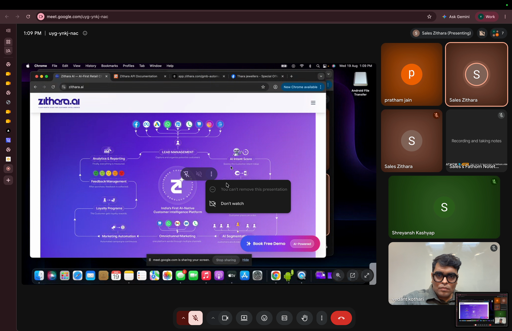

---

### Screen 2: Omnichannel Marketing, Loyalty & ROAS [02:40]
Details the omnichannel outreach capabilities including RCS messaging, calling campaigns, loyalty points with website redemption redirection, Google reviews aggregation, and return-on-ad-spend (ROAS) analytics bridging web purchases and physical store walk-ins.

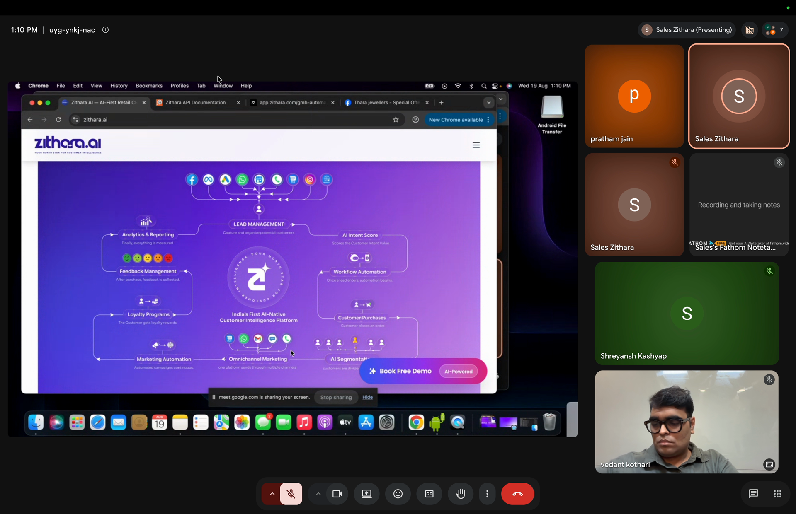

---

### Screen 3: Click-to-WhatsApp (CTWA) Demo Ad [05:25]
The presenter shares a live Click-to-WhatsApp ad for fictitious brand "Thara Jewellers" to demonstrate how an ad viewer clicking "WhatsApp" triggers automated CRM ingestion.

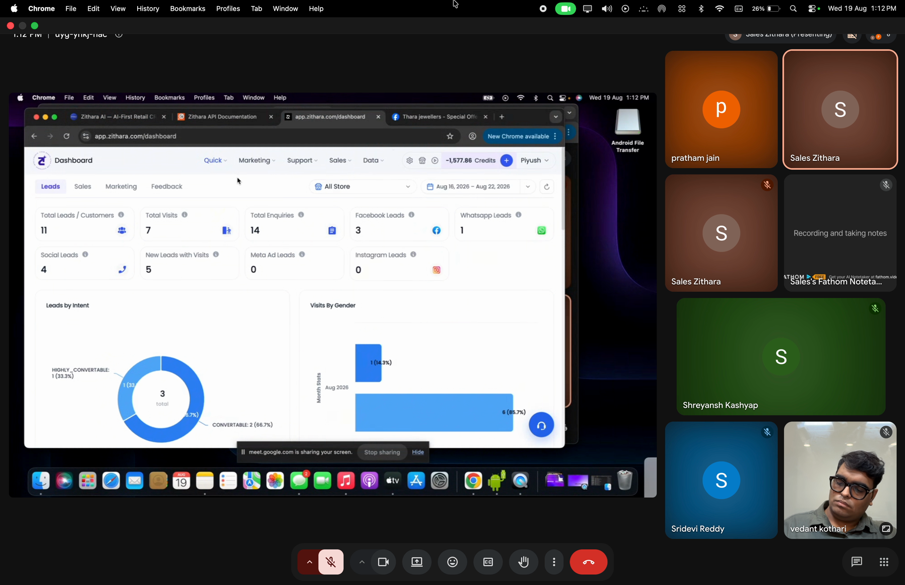

---

### Screen 4: Web Dashboard & Navigation Architecture [07:55]
The top navigation bar reveals Zithara's hierarchy:
- **Top Menus:** `Quick`, `Marketing`, `Support` (Chat Agent, WhatsApp Bot, Instagram Bot [Beta], Automated Messages, Support Tickets), `Sales` (Task Management, Lead Management), `Data`.
- **KPI Metrics:** Total Leads/Customers (11), Total Visits (7), Total Enquiries (14), Facebook Leads (3), WhatsApp Leads (1), Social Leads (4), New Leads with Visits (5).
- **Charts:** Donut chart for `Leads by Intent` (`HIGHLY_CONVERTABLE`, `CONVERTABLE`) and Bar chart for `Visits by Gender`.

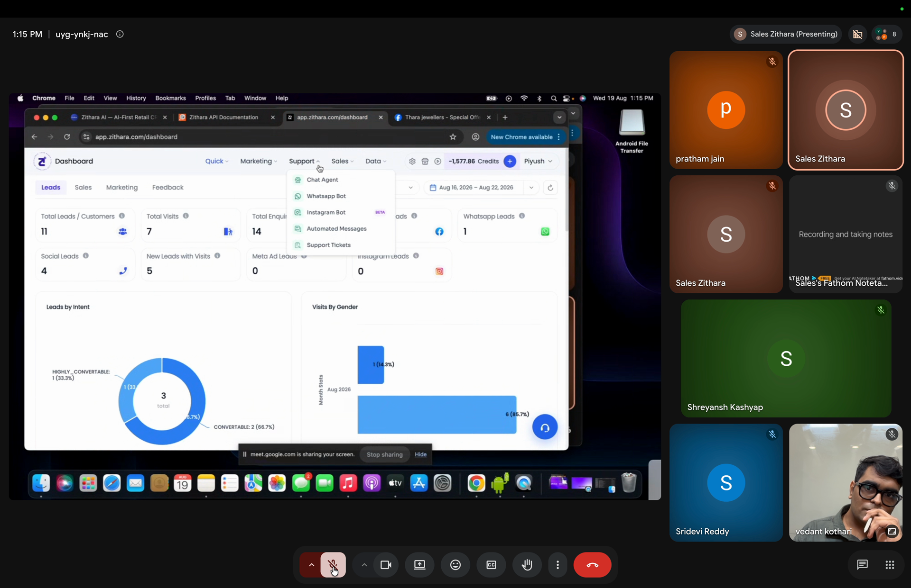

---

### Screen 5: Meta Lead Ads Multi-Question Form Ingestion [09:15]
Demonstrating Meta Lead Form mapping:
- URL: `app.zithara.com/meta-accounts/9900100002`
- Header: `Ads & Forms / Unknown Form` (`Ad: Gold Bangles Offer | Static | D - 225 leads`)
- Stats: Total Fills: 1.8K across 8 forms; New Leads: 1.2K (66.4%); Existing: 605 (33.6%).
- Form submissions table dynamically surfaces custom questionnaire fields: Customer ID, Phone, Email, Lead Customer Status (`Old Lead`, `New Lead`, `New Customer`), Submitted Timestamp, plus custom form answers (`City`, `Full Name`, etc.).

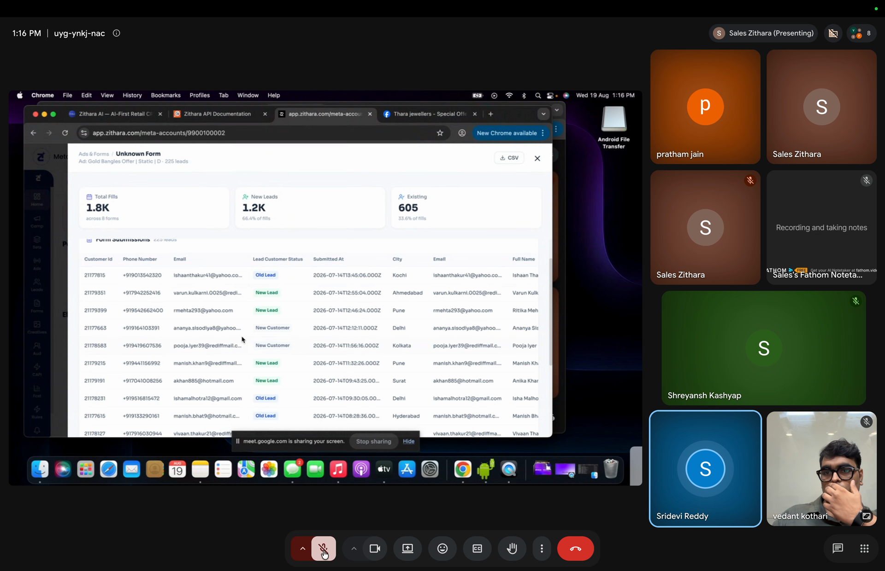

---

### Screen 6: Unified 3-Pane Chat Agent / Inbox [10:05]
The primary communication interface:
- **Left Pane (Conversation List):** Filter pills (`All 1000+`, `Open 999`, `Unread 428`), search bar, assigned agent badge (`Assigned to: akhil`, `Demo`), priority tag (`medium`), phone badge (`+91 97012 42123`).
- **Middle Pane (Chat Thread):** Active WhatsApp conversation with live AI Bot auto-replies (`- Send by: WhatsApp bot`). Action bar with `Reply`, `✨ Reply with AI`, `Private Notes`, `Intent score > (BETA)`, bottom action pills `Summarize`, `Templates`.
- **Right Pane (Customer Profile):** Avatar, New Contact badge, `opt out?` toggle, Tabs for `Person` and `More Details`, expandable sections for `Customer Profile`, `Customer Tags`, and `Conversation Tags`.

---

### Screen 7: Live AI Bot Conversation with Client [10:45]
Client types "Pricing", AI immediately responds: *"Got it, Vedant! Our pricing is custom based on your setup. Want me to schedule a quick demo call to get you a tailored quote?"*. Client says "No", AI responds politely: *"No worries, Vedant! If you change your mind or want details later, just let me know. Anything else I can help with today?"*. Client replies "Nothing", AI closes smoothly.

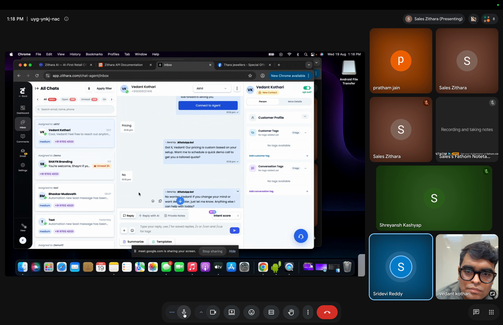

---

### Screen 8: Real-Time Intent Analysis Modal [11:15]
Clicking the `Intent score > (BETA)` button opens a dedicated analysis side-drawer:
- **Circular Gauge Score:** `65 / SCORE`
- **Badges:** `Easy to Convert` (green badge), `Price Check` (gray badge)
- **AI Reasoning:** *"Customer asked pricing, indicating buy interest. No demo interest."*
- **Suggested Actions:**
  1. *"Share tailored pricing options or schedule a quick call for a custom quote"*
  2. *"Offer a brief demo later if they revisit pricing or request more details"*
- **Customer Facts:** Last updated timestamp.

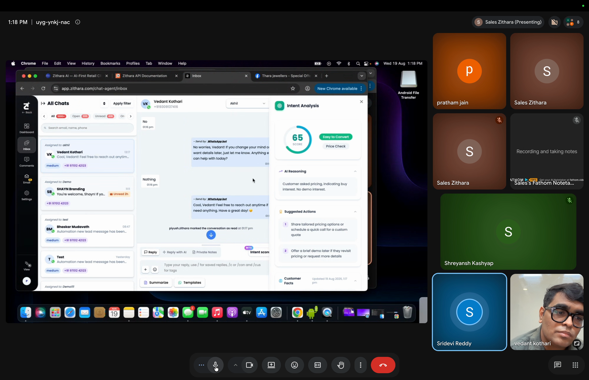

---

### Screen 9: Meta Ads List & "Configure AI" Action [19:05 / 1150s]
Navigating to `Marketing > Meta Ads > Ads`:
- Columns: `SALES AGENT`, `AD NAME`, `STATUS` (ACTIVE), `GOALS`, `CAMPAIGN NAME`, `OBJECTIVE`, `ADSET NAME`, `MANAGE`.
- Each ad row features a prominent button: **`💬 Configure AI ⚡`**.

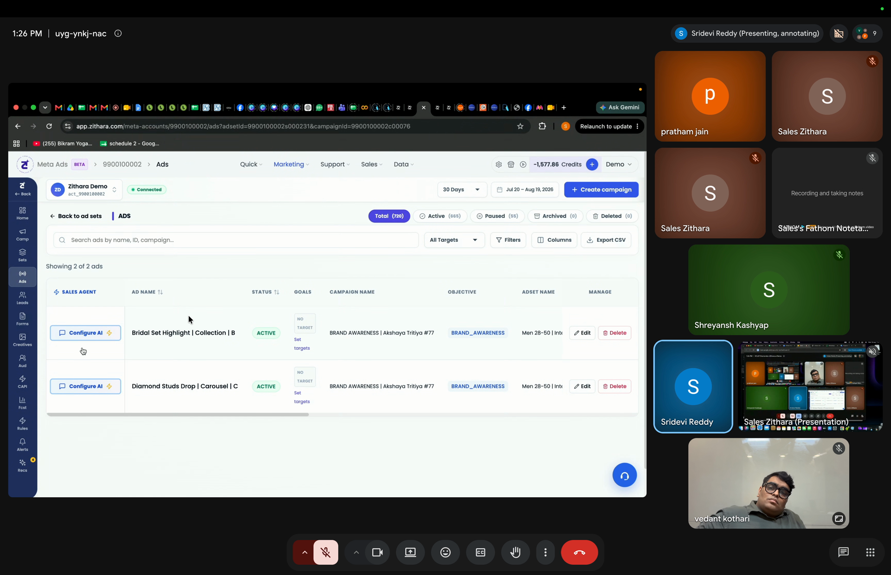

---

### Screen 10: AI Configuration Guide & Guardrails Policy [19:16 / 1156s]
Clicking `Configure AI` opens a comprehensive guidance modal detailing how to instruct the AI agent for that specific ad:
- **Context Guidelines:** Campaign goals, pricing info, special instructions, target audience.
- **Guardrails Guidelines (Yellow Shield):** Restricted topics (e.g. competitor products), policy restrictions (e.g. delivery promises), approval requirements (e.g. no discounts without manager approval), prohibited actions, tone restrictions.
- **Best Practices (Green Check):** Specificity, keeping context focused, testing responses.

---

### Screen 11: Sales Agent Config Editor (Context & Guardrails) [19:45 / 1185s]
The second step allows direct authoring with live character/word counters and validation indicators:
- **Context (Required, 486/5000 chars):** Pre-structured prompts for key messaging, product details, campaign goals, pricing, special instructions.
- **Guardrails (Optional, 391/2000 chars):** Strict operational bounds (e.g. *"Do not discuss competitor pricing. Do not offer discounts without manager approval. Always verify customer information."*).
- Action button: `Save Sales Agent Config`.

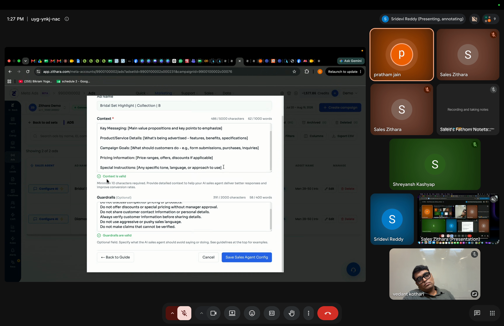

---

### Screen 12: Central Calling Team / Task Management [17:25 / 1055s]
Located at `Sales > Task Management` for centralized tele-calling teams:
- **KPI Summary Cards:** `Overdue: 94,569`, `To Do: 4 (Aug 19, 2026)`, `Upcoming: 39`, `Completed: 240`.
- **Filters:** Tabs for `Overdue`, `To Do`, `Upcoming`, `Completed`; toggle for `My` vs `All`; Date selector.
- **Task List:** Grouped under `Lead Follow Up - (4)`. Displays Lead Name, Due Date, Created Date, Status (`Pending`), and action buttons: `Take Action`, `View Details >`.

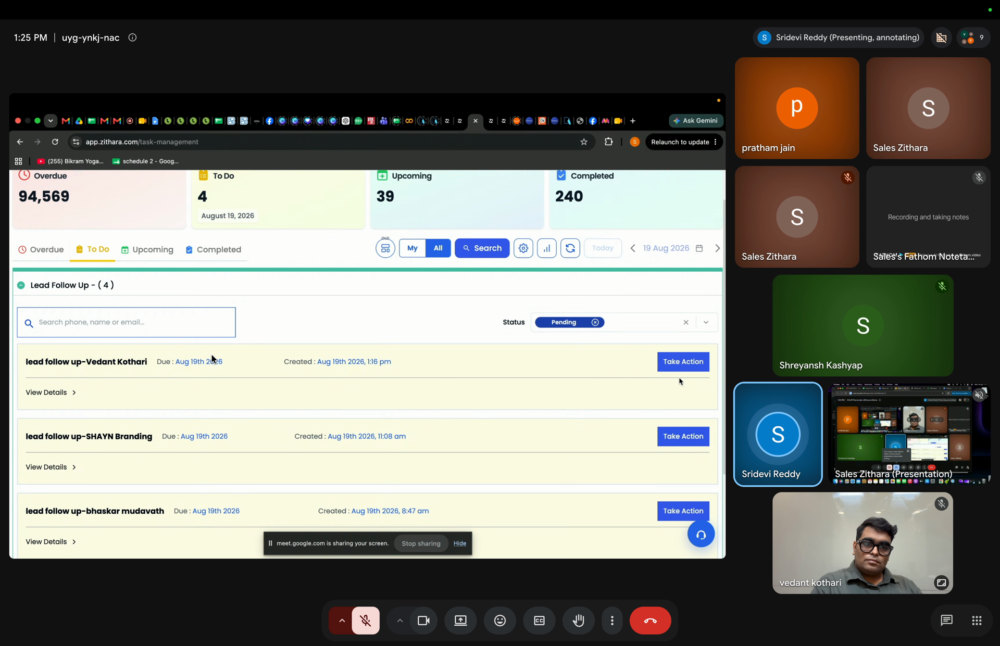

---

### Screen 13: Task "Take Action" Modal & Call Logs [17:45 / 1075s]
Clicking `Take Action` on a follow-up task opens a unified workspace modal:
- **Header Actions:** `🌿 Customer Journey`, `📝 Notes`, `📞 Call Logs`, `📋 Activities`.
- **Metadata Grid:** Customer Name, System Source (`Whatsapp`), Phone, Status (`Pending`), Priority (`high`), Assigned Employee, Follow Up Date, Store Name (`Thara jewllers Banglore`).
- **Customer Summary:** Total Orders, Total Visits, Last Visit, Total Spent.
- **Footer Actions:** `🔁 Sync Buttons`, `✔ Mark As Completed`, `📞 Manual Call` (triggers telephony dialer).

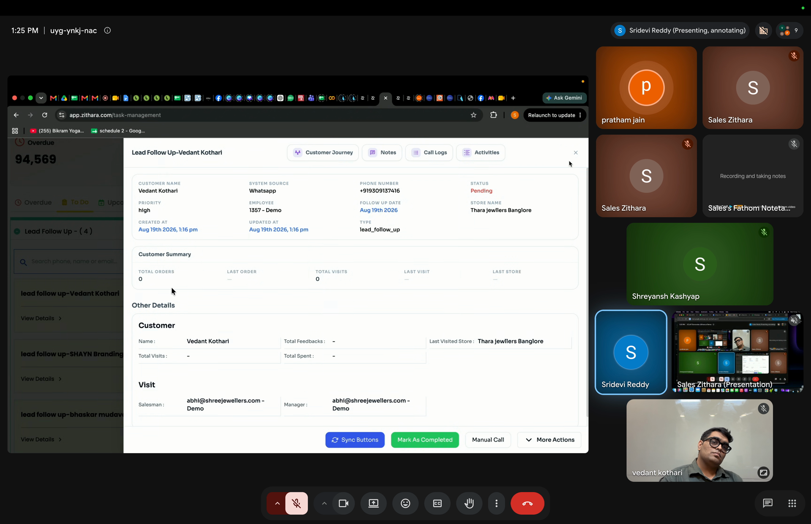

---

### Screen 14: Mobile In-Store Showroom App — Lead Feed [26:55]
A dedicated mobile-first web app / PWA for floor sales staff:
- **Header:** `zithara.ai - YOUR NORTH STAR FOR CUSTOMER INTELLIGENCE`, User profile, `Leads (45,189)` with refresh and filter buttons.
- **Omni Search:** `Enter mobile, name to search / create Lead`.
- **Lead Cards:** Shows avatar, name, customer tenure (`Customer since 18 minutes ago`), Customer ID, linked channel badges (`WhatsApp`), phone number, lead source (`Facebook`), and primary action buttons:
  - `💬 Chat`
  - `Create Visits` (primary action when customer arrives in showroom).
- **Bottom Navigation (5 Tabs):** `Leads`, `Visits`, `Dashboard`, `Tasks`, `Forms`.

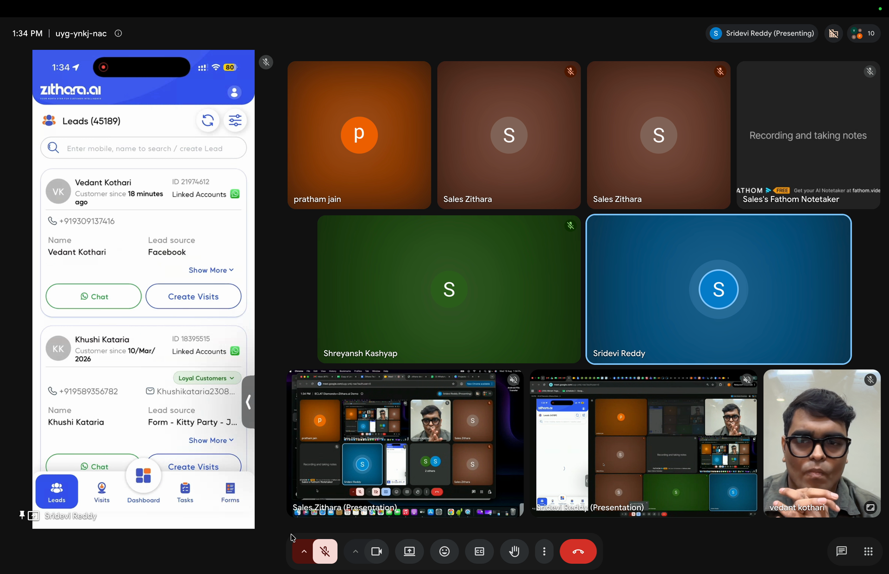

---

### Screen 15: Mobile Customer Profile & Attended History [27:15]
Tapping a customer displays their full retail profile:
- Tabs: `Customer Details` | `Customer Journey`
- Fast Metrics: `Visits: 0`, `Enquiry's: 0`, `Tasks: 1`.
- History: `Last Visited On`, `Last Attended by`, `Last Visited Store`, `Last Enquiry Date`.
- Section: `Mandatory Information` with inline edit icons for First Name and Last Visit Attended Employee.

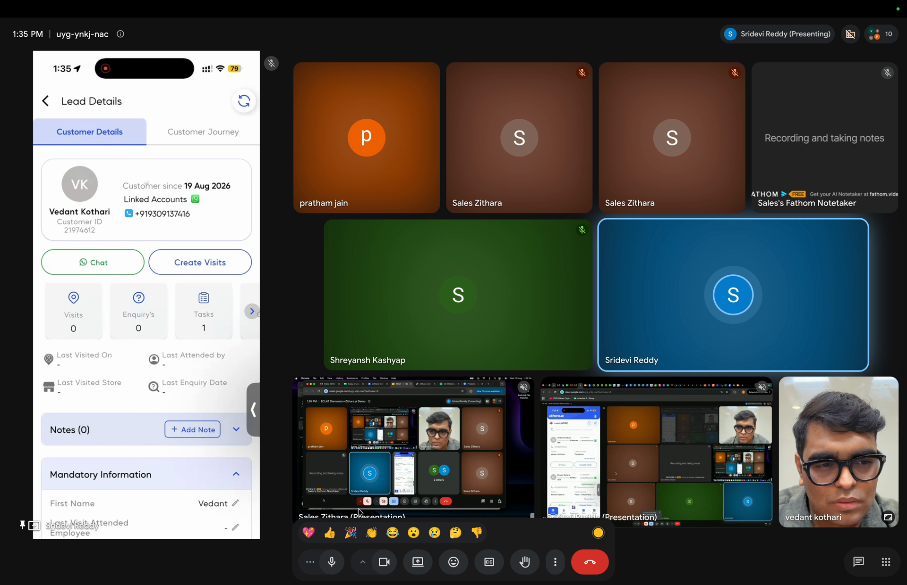

---

### Screen 16: Mobile Live Lead Search by Partial Phone [29:30]
Salesperson types `930` at the showroom counter, instantly matching the incoming visitor against active online leads:
- `Vedant Kothari` (+919309137416, Facebook ad lead from 21 minutes ago).
- `Vivaan Desai` (+919136930560, Gold Bangles offer form lead).
- Tapping `Create Visits` transitions directly into walk-in logging.

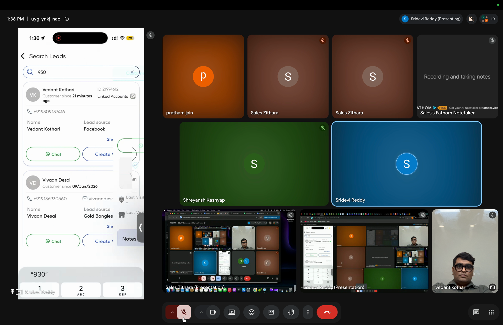

---

### Screen 17: Mobile Walk-in Logging & Barcode Scanning ("Add Visits") [30:15]
The walk-in interaction capture form:
- Title: `< Add Visits`
- Card: `Enquiry 1` (supports multiple enquiries per walk-in).
- **Product Details:**
  - `Product Based On *`: Dropdown (`Male` / Female / Unisex)
  - `Product Category *`: Dropdown (`Bracelets` / Rings / Necklaces / Bangles)
  - `Is Enquiry Converted`: Checkboxes `[] Yes` | `[x] No`
  - `barcode *`: Text input with a blue **`Scan`** button (activates camera / barcode reader to log exact jewelry SKU viewed).
  - `Not purchase reason`: Dropdown (e.g. "Looking for ready products", "Design not liked", "Price constraint").
- **Store Details:** Assigned salesperson.

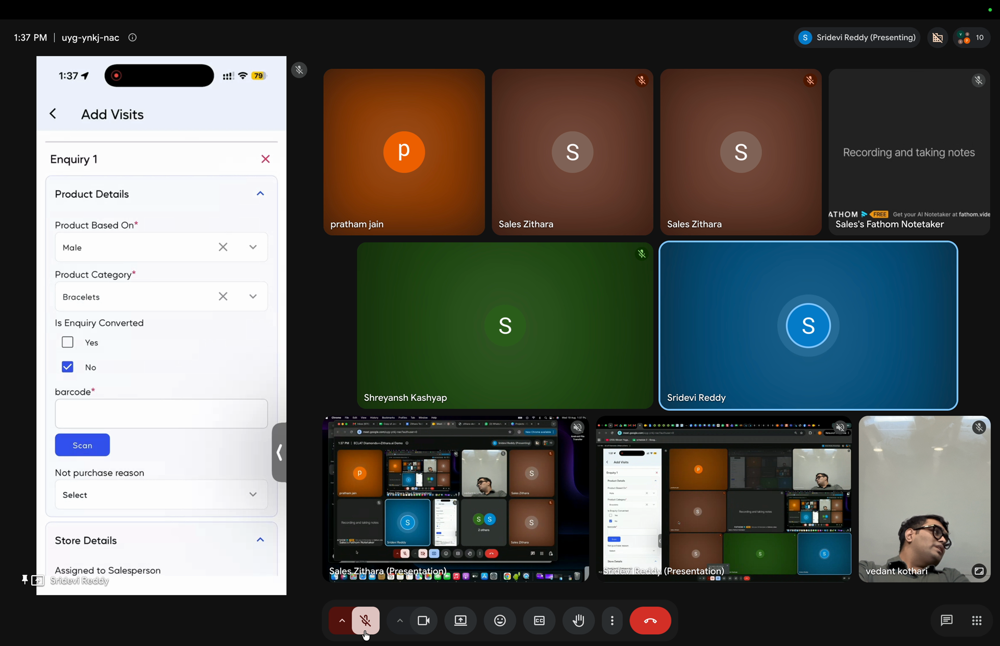

---

### Screen 18: Partial Conversion, Occasion & Counter Selection [31:40]
Second half of the visit capture form:
- `Occasion`: Dropdown (`Birthday`, Anniversary, Wedding, Festival).
- `Counter *`: Dropdown (`3` - Gold Counter, Diamond Counter, Silver Counter).
- **Visit Status:**
  - `Is Converted *`: `[] Yes` | `[] No`
  - `Follow Up Date`: Date picker (`Select date [calendar]`).
- **Attended By:**
  - `Store Name`: `Thara jewllers Banglore`
  - `Salesman`: `abhi@shreejewellers.com - Demo`

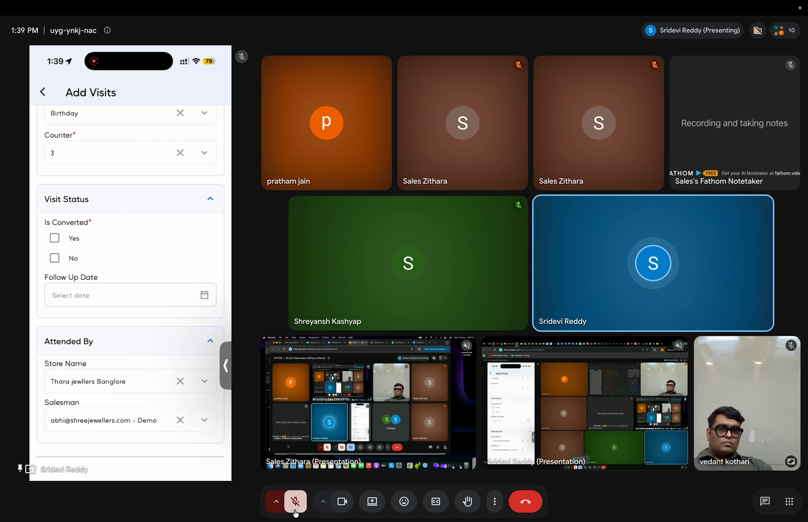

---

## 3. Verbatim Audio & Dialogue Analysis

Across the 40:24 discussion, four main speakers participate:
1. **Sales Zithara (Presenter / Senior Commercial Lead):** Drives the demo, explains ROI, routing architecture, and commercial packaging.
2. **Sridevi Reddy (Technical Co-presenter / Screen Sharer):** Navigates the live platform, configures rules, demonstrates the mobile app.
3. **Client (Vedant Kothari, Eclat Co-founder / Retail Operations Head):** Probes real-world edge cases, challenges AI scoring, questions multi-city store routing, and evaluates pricing.
4. **Pratham Jain (Client Team):** Participates in evaluation.

### Key Audio Quotes & Strategic Takeaways

#### 1. Real-Time Lead Intent Scoring Calibration [11:12–11:38]
- **Presenter:** *"We now measured your intent score as 65... saying the next action is price sheet."*
- **Client:** *"It is 65 is easy to convert, but I haven't given a single good score... I said no and nothing."*
- **Presenter:** *"Forget about the label. That is just a demo system... This is how we establish the score... because you have not been forthcoming with your requirement."*
- **Takeaway for Eclat:** Intent scoring cannot be a black box or hardcoded label. It must have **transparent, explainable signal weights** (e.g. penalty for negative answers, bonus for asking about pricing/scheduling) and **confidence calibration**.

#### 2. Multi-City Routing vs Store-Specific Numbers [12:26–15:50]
- **Client:** *"Since we are located in different cities... every store has a mobile number and store manager. We run ads particularly for Hyderabad... How will it work? All leads from all phone numbers come at one place?"*
- **Presenter:** *"Yes, that's your singular Meta account. Every Meta ad has a name... Whenever any brand runs location-specific ads, they make location part of it: 'Hyderabad ad', 'Borivali ad'... We receive tags from Meta, and based on the customer tag or ad name, Zithara moves the lead to the Hyderabad store manager."*
- **Takeaway for Eclat:** Eclat's `AdSetRulesService` already supports matching by `ad_id`, `ad_set_name`, and `tag`. Inbound WhatsApp referral attribution routes to `Conversation.storeId` and assigns the designated store salesperson.

#### 3. AI First vs Human Only: Franchise Selling Ads [15:59–18:22]
- **Client:** *"We also run franchise selling ads. In franchise ads, I don't want the AI bot to contact them. I want a human agent to contact them directly. What can be done?"*
- **Presenter:** *"AI is attached to the ad... In Meta Ads, under Ad Sets, you configure AI. On 'Bridal set highlight' you configure AI on. For franchise selling ads, you don't configure AI, and it stops responding—routing directly to human."*
- **Takeaway for Eclat:** The `AdSetAutomationRule` in Eclat already has `handling: 'ai' | 'human'`. When `handling === 'human'`, automated AI reply triggers are bypassed and the conversation lands in the human queue.

#### 4. The Showroom Walk-in Connection & Barcode Capture [23:29–28:35]
- **Presenter:** *"The offline store data capture... If Vedant clicked an ad on Facebook and visits the showroom today, in the absence of a tool like Zithara, no one in your store knows Vedant checked out a Facebook ad. That is lost... With the in-store app, staff search his phone number, pull up his Facebook ad origin, log his walk-in, and scan barcodes of items he tried on."*
- **Takeaway for Eclat:** This is the core differentiator. Eclat needs the dedicated mobile showroom view with instant phone search, ad attribution badge, and camera barcode scanner.

#### 5. Telephony / IVR Recordings [25:45–26:24]
- **Client:** *"The IVR thing that you just mentioned, we have to buy separately?"*
- **Presenter:** *"Yes, we are not a telephone company... The companies that provide this are Exotel, Tata Tele... We integrate their API so call logs and audio recordings appear in the task."*
- **Takeaway for Eclat:** Eclat should provide a provider-neutral telephony webhook contract (e.g. for Exotel / Tata Tele) that attaches call duration and audio recording URLs to `Activity` / `Task` records.

#### 6. Pricing & Commercial Structure [31:11–36:30]
- **Bands:**
  - 0–100,000 customers: ₹50,000 / month (billed 1 full year upfront = ₹6,00,000)
  - Unlimited user licenses across all stores.
  - No free trial (high onboarding/API setup cost).
  - Optional guided implementation: ₹50,000 / month.
- **Client Context:** 8 operative stores, 3 planned stores; ~15,000–20,000 existing customer records.

---

## 4. Comprehensive Feature Gap Analysis Matrix

The table below contrasts what Zithara.ai demonstrated against the current Eclat/CaratOS codebase:

| Feature / Capability | Zithara.ai Demo | Current Eclat / CaratOS Codebase | Status / Gap |
|---|---|---|---|
| **Meta CTWA Ingestion** | Full referral ingestion, creates lead and starts bot | `meta-referral.ts` parses `source_id` (ad id) from WhatsApp webhook; routes and attributes | **Built in backend**; needs live Meta webhook test |
| **Meta Lead Forms Ingestion** | Dedicated Forms tab; dynamically renders custom question answers (City, Name, Budget) | `lead-forms.service.ts` exists in backend; frontend lacks dynamic question/answer form viewer | **Partial** — backend exists, UI view missing |
| **Omnichannel 3-Pane Inbox** | Left conversation list, middle chat with bot badges, right Customer 360 sidebar | `frontend/src/app/(app)/conversations/page.tsx` has operational queues, thread view, and draft panel | **Built foundation**, but lacks Zithara's modern polished 3-pane layout |
| **Live AI Bot Auto-reply** | Automated WhatsApp replies with jewelry context | `ai-responder.ts` has auto-send with circuit breaker; UI currently shows drafts | **Partial** — backend ready, live chat UI needs polish |
| **Intent Analysis Card** | Circular gauge (0–100), intent pills, AI reasoning text, suggested action steps 1 & 2 | `qualification.service.ts` scores signals; `qualification-panel.tsx` renders basic signals | **Partial** — needs Zithara's visual circular gauge & action suggestions |
| **AI Config & Guardrails per Ad** | Ad table with `Configure AI` modal: Context (5000 chars) + Guardrails (2000 chars) | `adset-rules.service.ts` has `ai`/`human` toggle; lacks context/guardrails editor | **Gap** — needs Ad-Set AI Context & Guardrails configuration UI |
| **Ad-Set Store Routing** | Matches ad name / tag to store (e.g. "Hyderabad ad" -> Hyderabad store) | `AdSetRulesService` with priority matching on `ad_id`, `ad_set_name`, `tag` | **Built in backend & tested** |
| **Central Task Queue (Calling Team)** | KPI tiles (Overdue, To Do, Upcoming, Completed), Daily Follow-ups list | `crm/page.tsx` has Kanban board; lacks central tele-calling task dashboard | **Gap** — needs centralized Calling Team Task Queue page |
| **Task "Take Action" Modal** | Modal with Customer Journey, Notes, Call Logs, Activities, Manual Call | Basic dialogs exist in CRM; no unified task execution modal | **Gap** — needs unified Task Action modal |
| **IVR / Telephony Audio Playback** | Embeds Exotel/Tata Tele audio recordings in call logs | Call notes supported; no audio player or telephony provider webhook | **Gap** — needs telephony adapter contract & audio player |
| **In-Store Mobile Showroom App** | Mobile-first app for floor staff: phone lookup, Customer 360, Create Visits | Desktop `/checkins` and `/crm`; lacks dedicated mobile-optimized floor view | **Gap** — needs dedicated In-Store Showroom PWA interface |
| **Walk-in Barcode Scanning ("Add Visits")** | Multi-enquiry form with camera/Bluetooth barcode scan of items tried on | `ProductInteraction` model exists; no mobile scanner UI on visit logging | **Gap** — needs mobile Add Visits form with Barcode scanner |
| **Walk-out / Drop-off Reasons** | Captures reason customer didn't buy (e.g. "Looking for ready products") | Check-in outcome enum has basic values; lacks detailed retail drop-off taxonomy | **Gap** — needs structured walk-out reasons |
| **Lead Aging & Re-engagement** | Identifies returning leads from old campaigns (e.g. 109 new vs 53 existing) | `advanced-crm.service.ts` has `LeadAgeingPolicy` and stage SLA | **Built in backend**; needs frontend cohort visualization |
| **Customer Segmentation** | Auto-segments VIP, Loyal, One-Time Wonder | `crmLeadSegments` in backend; loyalty schemes in Module 17 | **Partial** — rules exist; needs UI segment builder |
| **Google Reviews & Feedback** | Single dashboard aggregating customer ratings & Google Reviews | Not built | **Gap** |
| **Full-Funnel ROAS Analytics** | Links digital Meta spend to both web orders and showroom visits | Separate measured/declared attribution in backend; no full ROAS dashboard | **Partial** — data layer exists; needs ROAS analytics UI |

---

## 5. UI / UX Design System Comparison

Zithara's UI has two distinct frontends:
1. **Desktop Web Application (`app.zithara.com`):**
   - Clean, light-mode business SaaS aesthetic with soft card borders (`border-slate-200`), rounded corners (`rounded-xl`), and vibrant primary accents (`#2563eb` blue, `#10b981` emerald for conversion badges).
   - Sticky top navigation with categorized dropdowns (`Marketing`, `Support`, `Sales`, `Data`).
   - Standardized KPI summary cards with large numerical metrics and colored icon badges.
   - Distinct 3-pane omnichannel inbox layout with rich contact avatars, channel indicators, and right-side collapsible intelligence panels.

2. **Mobile Showroom Floor App (`app.zithara.com` mobile viewport):**
   - Native mobile app feel with bottom navigation bar (5 tabs: Leads, Visits, Dashboard, Tasks, Forms).
   - High-contrast search bar supporting partial phone number queries for instant customer identification.
   - Compact lead cards with one-tap action buttons (`💬 Chat` and `Create Visits`).
   - Stepped "Add Visits" form with clear section accordions (`Product Details`, `Visit Status`, `Attended By`).
   - Integrated camera barcode scanner trigger for physical product tracking.

---

## 6. Implementation Architecture for Eclat / CaratOS

To bridge these gaps and surpass Zithara.ai, Eclat will implement five focused enhancements:

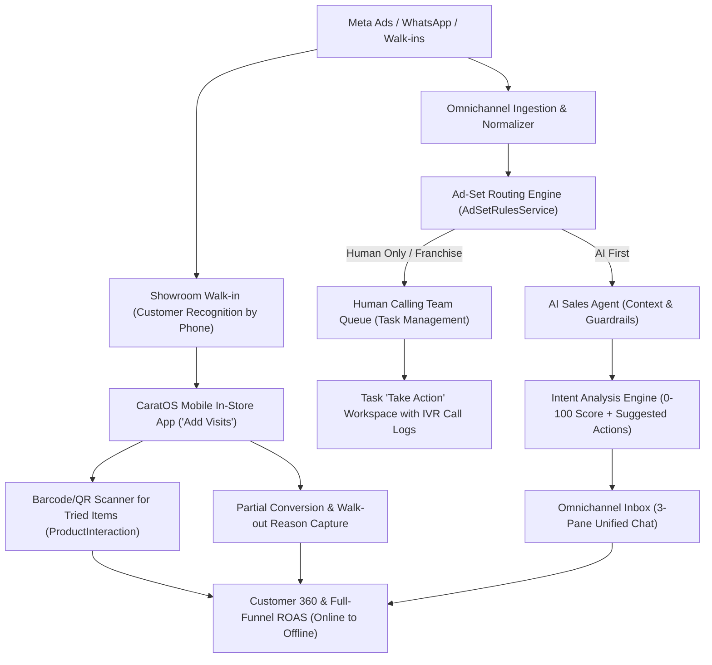
```mermaid
graph TD
    A["Meta Ads / WhatsApp / Walk-ins"] --> B["Omnichannel Ingestion & Normalizer"]
    B --> C["Ad-Set Routing Engine (AdSetRulesService)"]
    C -->|AI First| D["AI Sales Agent (Context & Guardrails)"]
    C -->|Human Only / Franchise| E["Human Calling Team Queue (Task Management)"]
    D --> F["Intent Analysis Engine (0-100 Score + Suggested Actions)"]
    F --> G["Omnichannel Inbox (3-Pane Unified Chat)"]
    E --> H["Task 'Take Action' Workspace with IVR Call Logs"]
    A --> I["Showroom Walk-in (Customer Recognition by Phone)"]
    I --> J["CaratOS Mobile In-Store App ('Add Visits')"]
    J --> K["Barcode/QR Scanner for Tried Items (ProductInteraction)"]
    J --> L["Partial Conversion & Walk-out Reason Capture"]
    K & L & G --> M["Customer 360 & Full-Funnel ROAS (Online to Offline)"]
```

1. **Enhancement 1: Interactive Intent Analysis & AI Sales Agent Configuration**
   - Implement the `Intent Analysis` card in the conversation inbox with circular gauge score, category pills, reasoning, and suggested actions.
   - Build the `Configure AI` modal for ad sets allowing marketing admins to define specific Context and Guardrails per ad.

2. **Enhancement 2: CaratOS In-Store Mobile Retail App**
   - Implement a mobile-first showroom floor view (`/instore` or `/mobile-crm`) with bottom navigation, fast phone lookup, lead origin indicators, and the multi-enquiry "Add Visits" form.
   - Integrate camera/Bluetooth barcode scanner to record jewelry items tried on (`ProductInteraction`).
   - Capture structured walk-out/drop-off reasons, occasion, and counter selection.

3. **Enhancement 3: Central Calling Team Task Management & IVR Player**
   - Build `/tasks` dashboard with KPI cards (Overdue, To Do, Upcoming, Completed).
   - Implement the "Take Action" modal with embedded telephony call log playback and quick completion actions.

4. **Enhancement 4: Meta Lead Forms Dynamic Answers & Aging Analytics**
   - Add the Meta Forms answers viewer showing dynamic question/answer submissions and old vs new lead status.
   - Visual lead aging cohort reports connecting ad campaigns to showroom visits.

5. **Enhancement 5: Google Reviews Aggregation & ROAS Dashboard**
   - Connect Google Business Profile reviews to the feedback tab.
   - Build the unified ROAS dashboard joining Meta ad spend with POS showroom sales.
